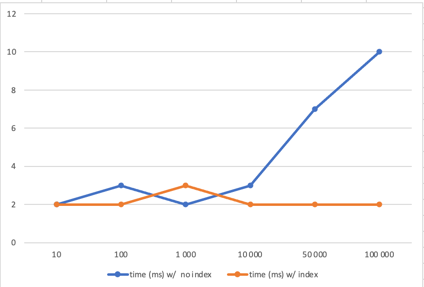

# TP Performance testing

These are the results I obtain (in seconds) without the index:

| Size    | Time (in ms) |
|---------|--------------|
| 10      | 2            |
| 100     | 3            |
| 1,000   | 2            |
| 10,000  | 3            |
| 50,000  | 7            |
| 100,000 | 10           |
| 500,000 | 41           |

The result is as expected because it should be increasing but it is not a complexity of O(n).
Moreover, it might be a mistake for 100 because it takes less time than 1,000.

These are the results I obtain (in seconds) with the index:

| Size    | Time (in ms) |
|---------|--------------|
| 10      | 2            |
| 100     | 2            |
| 1,000   | 3            |
| 10,000  | 2            |
| 50,000  | 2            |
| 100,000 | 2            |
| 500,000 | 2            |

The result is as expected except on 1,000 where the time should be equal to 2 ms because, with an index, the time of research must be constant.

Time of requests on sql lite db when setting an index or not:

